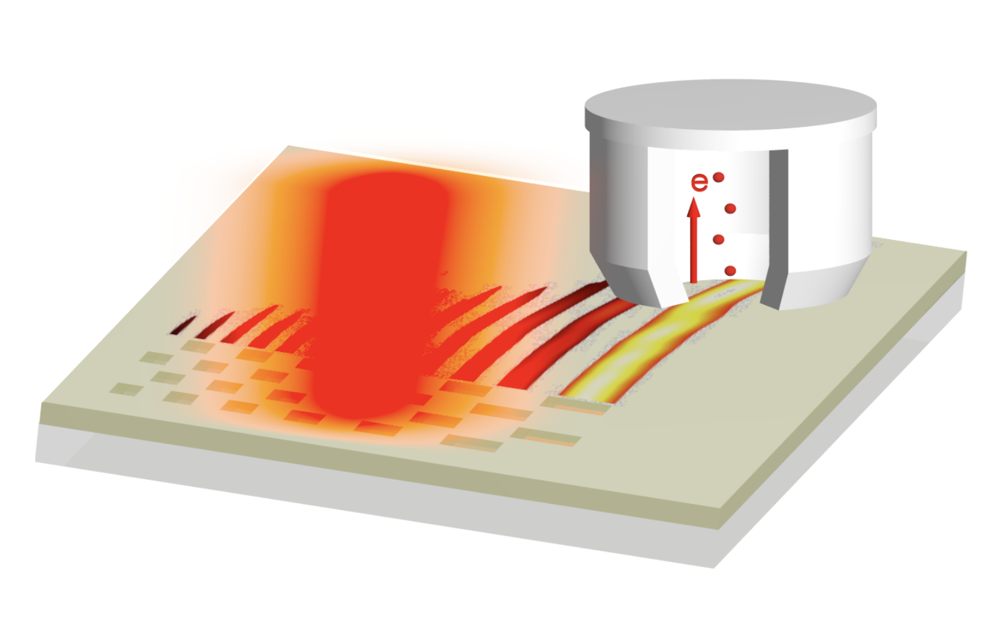

My Ph.D. research focuses on the topic ‘Spatiotemporal evolution of non-diffracting plasmonic pulses’. It has been divided into two phases ‘test-out research’ and ‘exploratory research’. In the so called ‘test-out phase’, a small incremental step has been taken to the established framework of published research on ‘Airy surface plasmons’. Airy plasmons are non-differacting electromganetic solution that can propagate on metal-dielectric interface. So far, researchers had investigated the non-diffracting properties only in spatial domains in 3 dimensions. My team have further investigated the 4th dimension the ‘time’ and it’s interdependence on space. The new phenomenon has been given a name ‘Airy plasmon pulses’. It studies the effect of pulsed excitation on non-diffracting properties of Airy plasmons. The graphics shows the Airy plasmon propagation on metal dielectric interface investigated by photoemission electron microscopy (PEEM). The image has been rendered using open source ray tracing software PovRay.

As the name suggest it is a 4 dimensional complex scientific problem. The problem has been broken down into two parts. The first part numerical simulation and second, experimental verification of the numerically calculated results. My contribution to the project has been in devising and managing very large scale numerical simulations of light scattering into various forms of surface plasmon polaritons on structured gold surfaces. To this end, I have been using two large software packages, one open-source MEEP and one commercial Lumerical FDTD Solutions, implementing the numerical finite-difference time-domain method which has so far been the only method that could provide rigorous solutions for the electromagnetic fields in the femtosecond domain. The use of these software packages is complex and years of dedicated work are required for reaching the expertise level. Aforementioned methods are very time and memory consuming numerical tools. My research institute ‘Institute of Applied Physics’ maintains several multi-CPU compute servers and a high performance compute cluster consisting of ~2000 cores. I used the availble resources to perform this challenging computational task.

The post processing of the data was performed in Matlab. A colleague from our research team has further verified the numerical results experimentally and a good agreement has been found between numerical and experimental results. The non-diffracting properties of Airy plasmon remains intact even under short pulse excitation. This is an interesting finding and implies large bandwidth of information can be carried without significant diffraction and dispersion over 30 µm on a metal-dielectric interface. This can find an interesting application in optical interconnects and communication devices. The results have been published in OSA Continnum.

The second phase of the research which I have made an original contribution to science by introducing the concept of ‘Airy plasmon pulses.’ This project investigates the spatiotemporal evolution of Airy plasmon pulses under very short fs pulse. The proof of the concept has been provided using numerical, analytical, semi-analytical methods. The work is published in Optics Express.

I defended my Ph.D. thesis on 01.02.2022 and have been awarded a Ph.D. degree (Dr. rer. nat.).

<!--more-->
